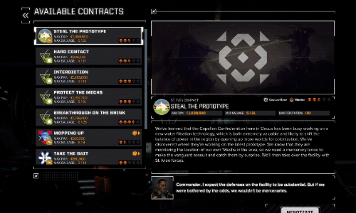

# BT: AlwaysRegenerateContracts
This is a mod for [BattleTech](https://store.steampowered.com/app/637090/BATTLETECH/) that regenerates the contracts whenever you enter the contract selection screen during a career playthrough.

## Disclaimer
This mod has *only* been tested with [RogueTech](https://www.nexusmods.com/battletech/mods/79?tab=description).   
This mod will not be incorporated into RogueTech and is not endorsed by the RT team as it ruins the balance in the game; the systems are balanced around flying around.   
This mod may interfere with campaign missions; although it shouldn't in theory.   
***Use at your own risk.***

## Prerequisites

BTML : https://github.com/janxious/BattleTechModLoader   
ModTek: https://github.com/janxious/ModTek

Install guide: https://github.com/janxious/ModTek/wiki/The-Drop-Dead-Simple-Guide-to-Installing-BTML-&-ModTek-&-ModTek-mods

## Installation
Place the contents of the zip file in your `\Steamlibrary\steamapps\common\BATTLETECH\Mods\` folder.

## Usage
Contracts will regenerate every time you enter the `contracts` screen.  
Please note that this may take a while. It might take up to a minute to finish.

